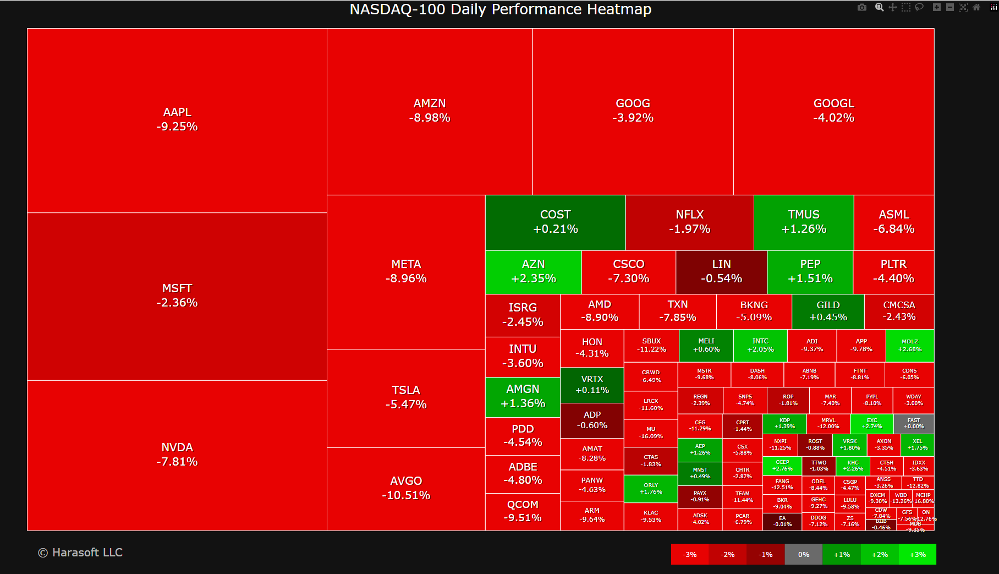

# NASDAQ-100 Daily Price Change Heatmap

This project provides a dynamic visualization of daily percentage price changes for NASDAQ-100 companies using a treemap heatmap. Inspired by FinViz's S&P 500 heatmap, it serves as an educational tool for exploring financial data fetching, processing, and interactive visualization.

## Features

- **Daily Data Updates**: Automatically retrieves the latest daily closing prices and computes percentage changes.
- **Market Capitalization-Based Sizing**: Company rectangles are sized according to market capitalization.
- **Interactive Visualization**: Interactive treemap created with Plotly; hover for detailed information.
- **Color Gradient**: Green indicates gains, and red indicates losses for intuitive data interpretation.

## Technologies Used

- **Python 3**
- **Pandas** – data manipulation
- **yfinance** – stock data retrieval from Yahoo Finance
- **Plotly** – interactive data visualization
- **Squarify** – treemap layout generation

## Project Structure

```bash
nasdaq-heatmap/
├── fetch_data.py          # Fetch NASDAQ-100 data using Yahoo Finance API
├── visual_data.py         # Generate interactive heatmap visualization
├── nasdaq100_data.csv     # CSV file with fetched data
├── nasdaq_heatmap.html    # Interactive HTML visualization
└── README.md              # Project documentation
```

## Installation

### 1. Clone the Repository

```bash
git clone <repository-url>
cd nasdaq-heatmap
```

### 2. Install Dependencies

```bash
pip install pandas yfinance plotly squarify
```

## Usage

Run the scripts to fetch data and generate the visualization:

```bash
python fetch_data.py
python visual_data.py
```

Open `nasdaq_heatmap.html` in a web browser to explore the interactive visualization.

## Sample Output

April 3, 2025:



## License

This project is licensed under the [MIT License](LICENSE).

## Disclaimer

This project is intended solely for educational purposes. It should not be used for trading or investment decisions.
